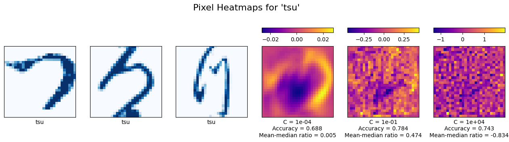
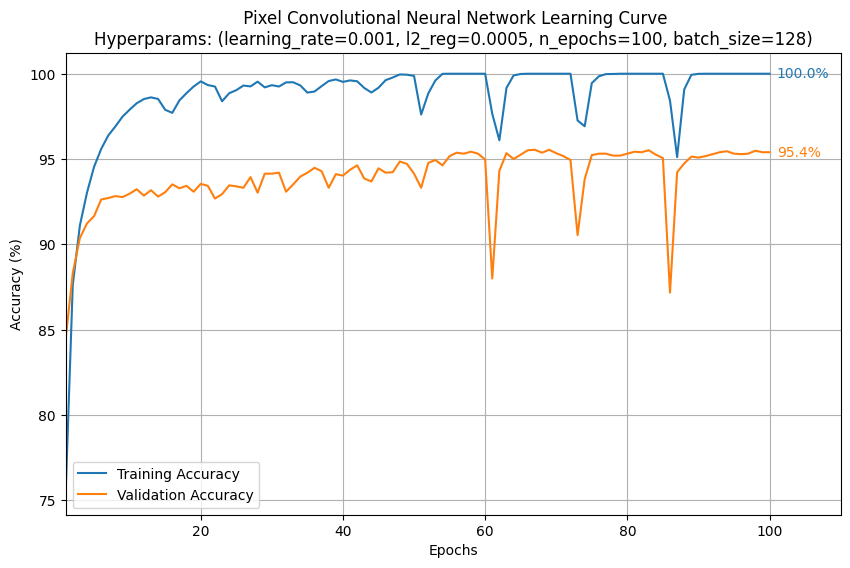
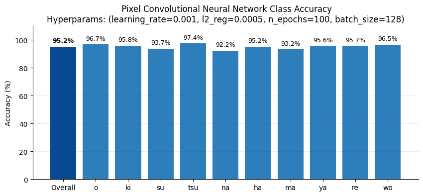
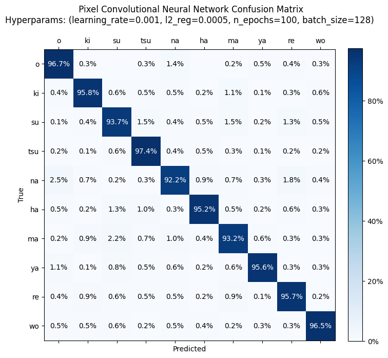

# Kuzishiji Handwriting Recognition
***Skills***_: Machine Learning, Python (Scikit-Learn, TensorFlow, Matplotlib, NumPy, Pandas)_

## Problem Overview
For over a thousand years Kuzushiji script dominated Japanese writing, until it was removed from school curriculum in 1900. As a result, vast collections of historical manuscripts, letters, and books remain inaccessible to the modern Japanese public. Digitization efforts are ongoing, but face a significant challenge: each character can be written in hundreds of stylistic variations depending on region, historical period, and individual handwriting. **This leaves many texts incomprehensible to all but expert linguists... and machine models.**

## Solution
I developed a machine learning pipeline capable of recognizing common handwritten Kuzishiji characters. Key features include:
- **Data Processing**: Generates vector embeddings from pixel data to improve robustness, with all models except the specialized Convolution Neural Network supporting both pixel and embedded data inputs.
- **Multimodel Evaluation**: Automatically trains, compares, and graphs results of Scikit-Learn machine learning models (Logistic Regression, k-NN, Decision Tree, Random Forest, Gradient Boosting) and TensorFlow deep learning models (Multilayer Perceptron, Convolutional Neural Network, Stochastic Gradient Descent).
- **Hyperparameter Autotuning**: Efficiently optimizes model hyperparameters using Bayesian Optimization with Optuna.
- **Result Visualization**: Plots confusion matrices, heatmaps, t-SNE projections, learning curves, and per-class accuracy charts to interpret the data and results.

## Key Results
- Achieved **>90% validation accuracy** with 7 out of 8 models through automatic hyperparameter tuning and vector embedding support.
- Achieved **95.1% validation accuracy** using a Convolutional Neural Network, trained to recognize nearly 7,000 variations of each character.
- Confirmed **balanced class performance** in the best model by plotting confusion matrices.

## Data Source
- **Kuzushiji-MNIST**: 70.0000 handwritten images (28x28 grayscale) of the 10 most common Kuzushiji characters in a variety of handwritings, from [Kaggle](https://www.kaggle.com/datasets/anokas/kuzushiji).

## Data Exploration

  

*Figure 1. Each Kuzushiji character features a vast variety of representations.*

### Pixel Weight Heatmaps

  

*Figure 2. Left: Examples of the character 'tsu'. Right: Pixel weight heatmaps for 'tsu', from three Logistic Regression models with different regularization values.*

Pixel-based models are highly dependent on normalized data (centered, scaled, and rotated). While the dataset is normalized and noiseless, small variations can still lead to misclassifications. Figure 2 shows that the weights for a Logistic Regression model differ substantially between pixels, with substantial differences in median and mean weights. Not all models are expected to perform well with pixel representations, so to improve robustness vector embeddings were derived from the pixel images (e.g., capturing shapes, curvatures, or slanting). Both embedding and pixel support was implemented for all models except the Convolutional Neural Network (CNN), which is designed for spatial pixel data.

### t-SNE Dimensional Collapse

  

*Figure 3. 2D projection of the 1280-dimensional embeddings.*

High-dimensional embeddings form clear, distinguishable clusters for each class, albeit with some overlap. All models were trained and tested with both embeddings and pixel data (save CNN), as they differ in which suits them best.

## Results
| Model | Data | Eval | Val | Hyperparameters |
|--------|----------------|-------------|-------------|-----------------|
| Convolutional Neural Network | Pixel | **95.1%** | 95.4% | learning_rate = 0.001, l2_reg = 0.0005, n_epochs = 100, batch_size = 128 |
| Nearest Neighbors | Pixel | **93.8%** | 93.7% | n_neighbors = 1 |
|  | Embed | 90.2% | 90.5% | n_neighbors = 7 |
| Multilayer Perceptron | Embed | **92.6%** | 92.8% | learning_rate = 0.0001, l2_reg = 0.0001, n_epochs = 95, batch_size = 32 |
|  | Pixel | 92.1% | 92.3% | learning_rate = 0.005, l2_reg = 1e-05, n_epochs = 75, batch_size = 160 |
| Histogram Gradient Boosting | Pixel | **91.7%** | 91.9% | max_depth = 16, learning_rate = 0.1, l2_regularization = 0.05 |
|  | Embed | 90.5% | 90.7% | max_depth = 11, learning_rate = 0.1, l2_regularization = 0.01 |
| Stochastic Gradient Descent | Embed | **91.4%** | 91.4% | learning_rate = 0.0005, l2_reg = 0, n_epochs = 30, batch_size = 64 |
|  | Pixel | 78.8% | 79.5% | learning_rate = 0.001, l2_reg = 0.0005, n_epochs = 85, batch_size = 192 |
| Logistic Regression | Embed | **91.1%** | 90.9% | C = 0.05 |
|  | Pixel | 79.2% | 79.3% | C = 0.05 |
| Random Forest | Pixel | **90.5%** | 90.7% | max_depth = None, n_estimators = 170 |
|  | Embed | 86.0% | 86.6% | max_depth = None, n_estimators = 190 |
| Decision Tree | Pixel | **67.2%** | 67.6% | max_depth = 15 |
|  | Embed | 58.0% | 58.4% | max_depth = 19 |

*Table 1. Most performative model of each model type and data representation, sorted by evaluation performance.*

The Convolutional Neural Network (CNN) achieved the highest accuracy, consistent with expectations given its design for spatial data categorization.

  

*Figure 4. Learning curve of the Convolutional Neural Network, trained on a pixel representation of the data.*

The CNN outperforms other models within the first few epochs and continues to improve until the final epoch. 100% training accuracy indicates the model successfully captures detailed structural patterns. Occasional downward spikes are likely due to batch variability, as train and validation spikes align.

  

*Figure 5. Bar chart showing overall and per-class validation accuracy of the Convolutional Neural Network, trained on a pixel representation of the data.*

Class accuracies range between 92.2% and 97.4%, with minor imbalances explaining small variations in overall performance.

  

*Figure 6. Confusion matrix showing per-class classification of the Convolutional Neural Network, trained on a pixel representation of the data.*

The character 'na' is occasionally misclassified as 'o' and vice versa, due to visual similarities between 'na' and the left half of 'o' in certain variants. These misclassifications are rare (2.5% for 'na', 1.6% for 'o') but may explain the small spikes in the learning curve.

Conclusion
- CNN excels on spatial pixel data, achieving the highest accuracy (95.4%) among all models.
- No class imbalances were found, suggesting that the CNN can be used to classifly the trained Kuzushiji characters for similar datasets.
- Vector embeddings improved robustness and performance for Logistic Regression and Gradient Boosting, which together with the pixel images lead 7 out of 8 models to achieve an accuracy of >90%.